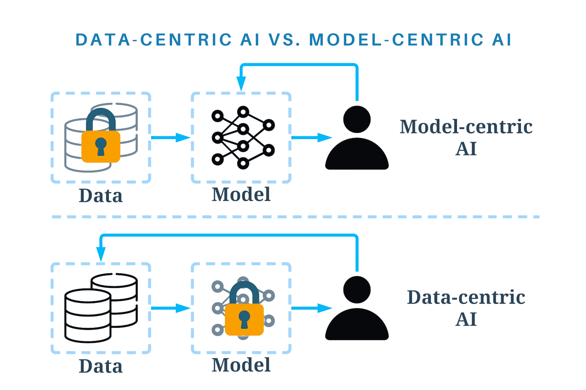

# Cuộc đua số 2023 - Thử thách: AI tập trung vào dữ liệu

Trong các bài toán thực tế, dữ liệu đóng vai trò vô cùng quan trọng trong việc xây dựng các hệ thống AI có độ chính xác cao và khả năng áp dụng thực tiễn. Nhận thức được điều này, nhiều công ty và tổ chức đã chuyển hướng phát triển AI theo hướng data-centric AI (AI tập trung vào dữ liệu), trong đó dữ liệu được coi là trung tâm và trọng tâm của quá trình xây dựng mô hình (xem thêm tại: [Data Centric AI - Landing AI](https://landing.ai/data-centric-ai/)). Trong thử thách **AI tập trung vào dữ liệu**, các đội chơi sẽ thể hiện khả năng trong việc xây dựng một bộ dữ liệu đủ tốt, đa dạng và đại diện để huấn luyện mô hình AI có độ chính xác cao cho bài toán phát hiện biển báo.



**Data-centric AI vs. model-centric AI - Hình ảnh từ [towardsdatascience](https://towardsdatascience.com/what-are-the-data-centric-ai-concepts-behind-gpt-models-a590071bb727).**

**Mã nguồn và cách đánh giá**

Mã nguồn và các siêu tham số của mô hình sẽ được cung cấp sẵn và cố định. Điều này đảm bảo các đội chơi có cùng một công cụ để huấn luyện và đánh giá mô hình. Các đội chơi sẽ phải tập trung vào việc xây dựng một bộ dữ liệu đủ tốt để huấn luyện mô hình AI có độ chính xác tốt nhất, với phần cứng hạn chế (số lượng iterations được hạn chế). Độ chính xác của mô hình AI sẽ được đánh giá trên tập dữ liệu bí mật (private test) mà các đội chơi không được tiếp xúc trước đó.

Data-centric AI đặt dữ liệu làm trọng tâm bởi vì một mô hình AI chỉ có thể hiểu và học từ những gì nó đã thấy. Để có một hệ thống AI chính xác, chúng ta cần xây dựng một tập dữ liệu phát hiện biển báo đa dạng, đại diện cho các tình huống thực tế và có khả năng tổng quát hóa. Các đội chơi sẽ phải đối mặt với các thách thức như thu thập dữ liệu, tiền xử lý và gán nhãn để tạo ra một tập dữ liệu chất lượng cao.

## 0. Cài đặt môi trường thử nghiệm

Các đội chơi có thể sử dụng môi trường local, Google Colab, hoặc Kaggle Notebook để thử nghiệm và nộp kết quả. Tuy nhiên, các đội chơi cần đảm bảo môi trường thử nghiệm có đủ các thư viện và phiên bản như sau:

- Python 3 (khuyến nghị Python 3.9).
- PyTorch 2.0.1.
- Các đội chơi sử dụng Windows cần tải và sử dụng [Git Bash](https://git-scm.com/downloads).

Ở môi trường local, các đội chơi sử dụng [Anaconda](https://docs.conda.io/en/latest/miniconda.html)/[Miniconda](https://docs.conda.io/en/latest/miniconda.html) để thiết lập môi trường. Sau khi cài Conda, để tạo môi trường thử nghiệm với tên `tfs`, các đội chơi chạy lệnh sau:

```shell
conda create -n tfs python=3.9 -y
```

Sau khi tạo môi trường, các đội chơi cần kích hoạt môi trường `tfs` bằng lệnh:

```shell
conda activate tfs
```

Clone mã nguồn và cài đặt các gói cần thiết:

```shell
git clone https://github.com/makerviet/tfs-data-centric
cd tfs-data-centric
conda activate tfs
pip install torch==2.0.1
pip install -e .
```

## 1. Mã nguồn huấn luyện và dữ liệu mẫu

### 1.1. Mã nguồn huấn luyện

Mã nguồn huấn luyện được phát triển từ mã nguồn của YOLOX, với mô hình YOLOX Nano. Các đội chơi **chỉ sử dụng mã nguồn có sẵn, không tinh chỉnh kiến trúc mô hình, các siêu tham số của mô hình**. Các đội chơi trước khi vào vòng cuối sẽ nộp lại toàn bộ dữ liệu và kết quả cuối cùng sẽ được huấn luyện và xếp hạng trên toàn bộ dữ liệu, theo mã nguồn và các siêu tham số đã được cung cấp từ trước.

### 1.2. Dữ liệu mẫu

Để tải về dữ liệu mẫu, các đội chơi chạy lệnh sau:

```shell
bash tools/download_data.sh
```

Hoặc tải về dữ liệu mẫu tại [đây](https://github.com/makerviet/via-datasets/releases/download/v1.0/via-trafficsign-coco-20210321.zip) vàm giải nén vào thư mục `datasets/vtfs/COCO`. Sau khi chạy lệnh trên, hoặc giải nén thủ công, cấu trúc dữ liệu sẽ như sau:

```
+ datasets
    + vtfs
        + COCO
            + annotations
                - train.json
                - val.json
            + images
                - train
                    - 000001.jpg
                    - ...
                - val
                    - 000001.jpg
                    - ...
+ docs
+ exps
...
```

## 2. Huấn luyện và đánh giá mô hình đã huấn luyện trên môi trường local

- Các bước huấn luyện
- Các bước đánh giá
- NOTE: Không được thay đổi các siêu tham số của mô hình

## 3. Tải lên mô hình và đánh giá trên tập dữ liệu bí mật

- Các bước tải lên
- Các bước đánh giá

## 4. Phương pháp xây dựng bộ dữ liệu

- Các bước thu thập, gán nhãn dữ liệu
- Các bước tiền xử lý dữ liệu
- Gán nhãn dữ liệu với AnyLabeling hoặc labelme. Gợi ý các công cụ khác như CVAT, Label Studio, ...
- Bí quyết để có bộ dữ liệu tốt
